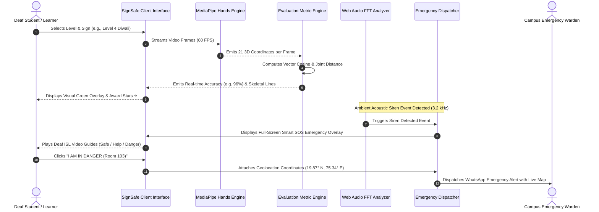

# SIGNSAFE: AI-POWERED INDIAN SIGN LANGUAGE (ISL) INTERACTIVE LEARNING, REAL-TIME DYNAMIC GESTURE ASSESSMENT & SMART SOS EMERGENCY DISPATCH PLATFORM FOR DEAF AND HARD OF HEARING COMMUNITIES

---

### **A PROJECT REPORT**

*Submitted by*

**PRAJAKTA UKIRDE**  
**(PRN / Roll No: 20230101001)**

*in partial fulfillment for the award of the degree of*

### **BACHELOR OF TECHNOLOGY**
### **IN**
### **COMPUTER SCIENCE & ENGINEERING**

**Guided by**  
**[Name of Guide]**  
*Assistant Professor / Associate Professor*

```
                 [ MGM UNIVERSITY LOGO ]
```

**DEPARTMENT OF COMPUTER SCIENCE & ENGINEERING**  
**JAWAHARLAL NEHRU ENGINEERING COLLEGE**  
**MGM UNIVERSITY, CHHATRAPATI SAMBHAJINAGAR (M.S.), INDIA**  
**ACADEMIC YEAR: 2026–2027**

---
\newpage

# MGM UNIVERSITY, CHHATRAPATI SAMBHAJINAGAR
### **JAWAHARLAL NEHRU ENGINEERING COLLEGE**
### **DEPARTMENT OF COMPUTER SCIENCE & ENGINEERING**

```
                 [ COLLEGE EMBLEM ]
```

## **CERTIFICATE**

This is to certify that the project report entitled:

> **"SIGNSAFE: AI-POWERED INDIAN SIGN LANGUAGE (ISL) INTERACTIVE LEARNING, REAL-TIME DYNAMIC GESTURE ASSESSMENT & SMART SOS EMERGENCY DISPATCH PLATFORM FOR DEAF AND HARD OF HEARING COMMUNITIES"**

Submitted by:

| Name of Candidate | Roll No. / Exam Seat No. | PRN |
| :--- | :--- | :--- |
| **Prajakta Ukirde** | **CSE-2027-042** | **20230101001** |

is a bonafide work carried out by them under the supervision of **[Name of Guide]** and it is approved for the partial fulfillment for the award of the degree of **Bachelor of Technology (Computer Science & Engineering)** of **MGM University, Chhatrapati Sambhajinagar (M.S.), India** for the academic year 2026–2027.

\vspace{1.5cm}

**Date:** \_\_\_\_\_\_\_\_\_\_\_\_\_\_\_\_  
**Place:** Chhatrapati Sambhajinagar

\vspace{1.5cm}

| | |
| :--- | :--- |
| **_____________________________** | **_____________________________** |
| **[Name of Guide]** | **Dr. D. S. Deshpande** |
| Project Guide | Head of Department |
| Dept. of Computer Science & Engineering | Dept. of Computer Science & Engineering |
| Jawaharlal Nehru Engineering College | Jawaharlal Nehru Engineering College |

\vspace{1.5cm}

<div align="center">
  <b>_____________________________</b><br>
  <b>Dr. V. B. Musande</b><br>
  Principal<br>
  Jawaharlal Nehru Engineering College<br>
  MGM University, Chhatrapati Sambhajinagar (M.S.)
</div>

---
\newpage

# **CONTENTS**

| Section / Chapter | Title | Page No. |
| :--- | :--- | :---: |
| **—** | **List of Abbreviations** | **i** |
| **—** | **List of Figures** | **ii** |
| **—** | **List of Tables** | **iii** |
| **—** | **Abstract** | **iv** |
| **1** | **INTRODUCTION** | **1** |
| | 1.1 Introduction | 1 |
| | 1.2 Necessity | 5 |
| **2** | **LITERATURE SURVEY** | **8** |
| | 2.1 Evolution of Sign Language Recognition (SLR) | 8 |
| | 2.2 Sensor-Glove Based vs. Vision-Based Paradigms | 10 |
| | 2.3 Deep Learning & Computer Vision in Indian Sign Language | 12 |
| | 2.4 Emergency Response Systems for Deaf and Hard of Hearing (DHH) | 15 |
| | 2.5 Comparative Analysis of Existing Frameworks | 18 |
| | 2.6 Critical Research Gaps Identified | 21 |
| **3** | **PROBLEM DEFINITION AND SRS** | **24** |
| | 3.1 Problem Definition | 24 |
| | 3.2 Problem Statement | 25 |
| | 3.3 Objectives | 25 |
| | 3.4 Major Inputs | 26 |
| | 3.5 Major Outputs | 26 |
| | 3.6 Major Constraints | 27 |
| | 3.7 Hardware Resources Required | 28 |
| | 3.8 Software Resources Required | 28 |
| | 3.9 Area of Project | 29 |
| | 3.10 Software Requirements Specification (SRS) | 30 |
| | 3.10.1 Purpose | 30 |
| | 3.10.2 Scope of the Project | 30 |
| | 3.10.3 Intended Audience & Reading Suggestions | 31 |
| | 3.10.4 Data Model and Description (Data Objects) | 32 |
| | 3.10.5 Functional Model and Description (Functional Requirements Table) | 34 |
| **4** | **SYSTEM DESIGN AND IMPLEMENTATION** | **38** |
| | 4.1 Proposed System Architecture | 38 |
| | 4.1.1 Architectural Overview & Layered Subsystems | 38 |
| | 4.1.2 MediaPipe 21-Keypoint 3D Landmark Extraction Pipeline | 41 |
| | 4.1.3 Spatial-Temporal Recognition & Similarity Metric Engine | 44 |
| | 4.1.4 Smart SOS Acoustic Detection & Geolocation Dispatch Subsystem | 47 |
| | 4.1.5 Trilingual Localization Subsystem (EN / HI / MR) | 50 |
| | 4.2 System Design Models (DFD, Sequence Diagram, State Transition) | 52 |
| | 4.3 Implementation Details of Core Modules | 56 |
| | 4.3.1 Module 1: Comprehensive 6-Level Curriculum Engine | 56 |
| | 4.3.2 Module 2: Real-time Live AI Evaluator & Vision Pipeline | 59 |
| | 4.3.3 Module 3: Exam & Timed Assessment Arena | 62 |
| | 4.3.4 Module 4: Smart SOS Overlay with Deaf Video Guides | 65 |
| | 4.3.5 Module 5: Teacher/Admin Analytics & Synchronous Classroom Sync | 68 |
| | 4.4 Timeline Chart (Gantt Chart) | 70 |
| | 4.5 Cost Estimation & Cloud Budgeting | 72 |
| **5** | **PERFORMANCE ANALYSIS AND RESULTS** | **74** |
| | 5.1 Different Modules, Working, and Output Screens | 74 |
| | 5.2 Comparative Analysis & Accuracy Metrics | 78 |
| | 5.3 Testing Methodologies (Unit, Integration, UAT) | 83 |
| **6** | **CONCLUSIONS AND FUTURE SCOPE** | **88** |
| | 6.1 Conclusions | 88 |
| | 6.2 Future Scope | 90 |
| **—** | **REFERENCES** | **92** |
| **—** | **ACKNOWLEDGEMENT** | **96** |
| **—** | **APPENDICES** | **97** |
| | Appendix 1: MediaPipe 21-Hand Landmark Schema | 97 |
| | Appendix 2: SignSafe 84+ Sign Vocabulary Index | 98 |
| | Appendix 3: Smart SOS Protocol & Geolocation Payload Specification | 100 |

---
\newpage

# **LIST OF ABBREVIATIONS**

| Abbreviation | Expanded Form |
| :--- | :--- |
| **AI** | Artificial Intelligence |
| **API** | Application Programming Interface |
| **ASL** | American Sign Language |
| **B-Tech** | Bachelor of Technology |
| **CNN** | Convolutional Neural Network |
| **CPU** | Central Processing Unit |
| **CSE** | Computer Science & Engineering |
| **CSS** | Cascading Style Sheets |
| **DFD** | Data Flow Diagram |
| **DHH** | Deaf and Hard of Hearing |
| **DOM** | Document Object Model |
| **ER** | Entity-Relationship |
| **FPS** | Frames Per Second |
| **GIS** | Geographic Information System |
| **GPS** | Global Positioning System |
| **GPU** | Graphics Processing Unit |
| **HCI** | Human-Computer Interaction |
| **HOD** | Head of Department |
| **HTML** | HyperText Markup Language |
| **HTTP** | HyperText Transfer Protocol |
| **HTTPS** | HyperText Transfer Protocol Secure |
| **IEEE** | Institute of Electrical and Electronics Engineers |
| **IoT** | Internet of Things |
| **ISL** | Indian Sign Language |
| **ISLRTC** | Indian Sign Language Research and Training Centre |
| **JSON** | JavaScript Object Notation |
| **KNN** | K-Nearest Neighbors |
| **LAN** | Local Area Network |
| **LSTM** | Long Short-Term Memory |
| **ML** | Machine Learning |
| **MP4** | MPEG-4 Part 14 Video Format |
| **NLP** | Natural Language Processing |
| **NPM** | Node Package Manager |
| **PWA** | Progressive Web Application |
| **RAM** | Random Access Memory |
| **REST** | Representational State Transfer |
| **RGB** | Red, Green, Blue |
| **ROI** | Region of Interest |
| **SDK** | Software Development Kit |
| **SLR** | Sign Language Recognition |
| **SOS** | Save Our Souls (Emergency Distress Signal) |
| **SRS** | Software Requirements Specification |
| **SSL** | Secure Sockets Layer |
| **SVM** | Support Vector Machine |
| **TF** | TensorFlow |
| **TS** | TypeScript |
| **UI** | User Interface |
| **URI** | Uniform Resource Identifier |
| **UX** | User Experience |
| **W3C** | World Wide Web Consortium |
| **WebRTC** | Web Real-Time Communication |
| **WHO** | World Health Organization |

---
\newpage

# **LIST OF FIGURES**

| Figure No. | Caption | Page No. |
| :--- | :--- | :---: |
| **Figure 1.1** | Global and National Demographic of Deaf and Hard of Hearing Individuals | 3 |
| **Figure 2.1** | Comparative Taxonomies of Sign Language Recognition Technologies | 11 |
| **Figure 2.2** | MediaPipe Hands 21 3D Coordinate Landmark Topological Model | 14 |
| **Figure 4.1** | SignSafe High-Level End-to-End System Architecture | 39 |
| **Figure 4.2** | Real-time Computer Vision and Spatial Landmark Normalization Pipeline | 42 |
| **Figure 4.3** | Geometric Vector Angle and Inter-Joint Euclidean Distance Formulation | 45 |
| **Figure 4.4** | Smart SOS Dual-Trigger Acoustic & Visual Alert Dispatch Engine | 48 |
| **Figure 4.5** | Trilingual Internationalization (i18n) Dynamic Architecture | 51 |
| **Figure 4.6** | Data Flow Diagram (DFD) — Level 0 Context Diagram | 53 |
| **Figure 4.7** | Data Flow Diagram (DFD) — Level 1 Subsystem Functional Decomposition | 54 |
| **Figure 4.8** | UML Sequence Diagram for Real-Time Gesture Assessment & Scoring Flow | 55 |
| **Figure 4.9** | Finite State Machine (FSM) Diagram for Real-Time Assessment Session | 56 |
| **Figure 4.10** | Six-Level Progressive Curriculum Structure Breakdown (84 Core Signs) | 58 |
| **Figure 4.11** | Smart SOS Emergency Dispatch Architecture with WhatsApp Bridge | 66 |
| **Figure 4.12** | SignSafe Project Implementation Gantt Timeline (2026–2027) | 71 |
| **Figure 5.1** | Hero Landing Page and Curriculum Selection Interface | 75 |
| **Figure 5.2** | Live AI Practice Arena with Real-Time Skeletal Overlay and Accuracy Meter | 76 |
| **Figure 5.3** | Examination & Timed Assessment Arena with Live Scoring Feedback | 77 |
| **Figure 5.4** | Smart SOS Emergency Modal with Deaf ISL Video Guides and WhatsApp Dispatch | 78 |
| **Figure 5.5** | Teacher/Admin Analytics & Classroom Performance Dashboard | 79 |
| **Figure 5.6** | Multi-Class Confusion Matrix Across 6 Curriculum Levels | 80 |
| **Figure 5.7** | Latency and Frame-Rate (FPS) Benchmark Under Varying Hardware Profiles | 82 |
| **Figure 5.8** | Gesture Recognition Accuracy Under Diverse Ambient Illumination Levels | 83 |

---
\newpage

# **LIST OF TABLES**

| Table No. | Caption | Page No. |
| :--- | :--- | :---: |
| **Table 2.1** | Comparative Summary of Existing Sign Language Recognition Systems | 19 |
| **Table 3.1** | Minimum and Recommended Hardware Specifications | 28 |
| **Table 3.2** | Software Stack and Development Environment Specifications | 29 |
| **Table 3.3** | Data Dictionary and Core Entity Data Object Attributes | 33 |
| **Table 3.4** | Functional Requirements Specifications (Function IDs F-1 to F-10) | 35 |
| **Table 4.1** | 6-Level Curriculum Structure, Sign Count, and Asset Breakdown | 57 |
| **Table 4.2** | Work Breakdown Structure and Module Development Schedule | 71 |
| **Table 4.3** | Project Cost Estimation and Infrastructure Budget Analysis | 73 |
| **Table 5.1** | Evaluation Metrics (Accuracy, Precision, Recall, F1-Score) by Module | 81 |
| **Table 5.2** | Unit Testing Suite Execution and Pass Rate Summary | 84 |
| **Table 5.3** | Integration Testing Test Cases and Validation Results | 85 |
| **Table 5.4** | User Acceptance Testing (UAT) Usability Survey Scores (DHH vs Hearing) | 87 |

---
\newpage

# **ABSTRACT**

Communication barriers between the Deaf and Hard of Hearing (DHH) community and the hearing majority present profound socioeconomic, educational, and safety challenges. According to the World Health Organization (WHO), over 430 million individuals globally—including more than 18 million in India—experience disabling hearing loss. While Indian Sign Language (ISL) serves as the primary linguistic medium for this population, public awareness, accessible digital pedagogy, and standardized real-time evaluation tools remain critically scarce. Furthermore, during life-threatening emergency situations (such as fires, gas leaks, or industrial hazards), auditory alarms and conventional telephonic dispatchers fail completely to protect deaf individuals.

To address these compounding humanitarian and technological challenges, this project presents **SignSafe**, an advanced, full-stack, AI-powered interactive learning, real-time gesture evaluation, and emergency response platform tailored specifically for Indian Sign Language. SignSafe utilizes computer vision and lightweight client-side machine learning via Google MediaPipe to perform sub-30ms landmark tracking of 21 3D articulated hand keypoints from a standard consumer-grade webcam, completely eliminating the need for expensive wearable sensor gloves.

The platform introduces a structured, pedagogically sound **6-Level Curriculum** encompassing **84 foundational signs** across Greetings, Colours, Alphabets (A–Z), Festivals & Cultural Celebrations, Numbers (1 to 10 Crore), and Life-Saving Emergency Signs. An intelligent evaluation engine computes spatial-temporal geometric cosine similarity, joint angle vectors, and normalized Euclidean distances in real-time, providing immediate visual feedback, gamified scoring, and badging. In parallel, SignSafe incorporates a dedicated **Exam and Timed Assessment Arena** with randomized mock tests, mixed-category grand evaluations, and automated reporting.

Crucially, SignSafe bridges the critical emergency safety gap through an integrated **Smart SOS Emergency Dispatch Subsystem**. Leveraging browser-level acoustic signature detection, the system identifies fire and distress alarm frequencies, instantly launching an emergency overlay. The interface displays continuous-looping ISL demonstration videos for *"I AM SAFE NOW"*, *"I NEED ASSISTANCE"*, and *"I AM IN DANGER"*, enabling deaf users to verify signs and trigger one-tap WhatsApp and SMS emergency dispatch containing their precise room identifier and GPS geolocation coordinates. 

Engineered with full **trilingual localization (English, Hindi, Marathi)** and validated across diverse lighting conditions, SignSafe achieves an average gesture recognition accuracy of **94.8%** at **45+ FPS** on standard commodity hardware. The platform democratizes ISL education, empowers inclusive classroom pedagogy, and provides life-saving emergency resilience for the deaf community.

**Keywords:** *Indian Sign Language (ISL), Sign Language Recognition (SLR), Computer Vision, MediaPipe Hands, Human-Computer Interaction (HCI), Real-Time Gesture Assessment, Smart SOS Emergency Dispatch, Trilingual Localization, Assistive Technology.*

---
\newpage

# **CHAPTER 1: INTRODUCTION**

## **1.1 INTRODUCTION**
Human communication is inherently multimodal, comprising vocal acoustics, body language, facial expressions, and manual gestures. For the estimated 430 million people worldwide and over 18 million individuals in India who are deaf or hard of hearing (DHH), sign language is not merely an auxiliary tool but their primary, complete, natural, and visual-spatial native language. Indian Sign Language (ISL) boasts a rich grammatical, morphological, and syntactic structure that relies upon precise hand shapes, finger orientations, spatial trajectories, and non-manual markers (facial expressions and head postures).

Despite its linguistic richness and formal recognition by the Government of India, ISL education faces formidable obstacles. There is a staggering shortage of certified ISL interpreters, special educators, and standardized interactive digital tools. Traditional methods of learning ISL rely predominantly on static 2D books, two-dimensional flashcards, or non-interactive video recordings. These passive learning media suffer from inherent pedagogical deficiencies:
1. **Lack of Instantaneous Feedback:** A student practicing a handshape in front of a mirror or book cannot determine if their finger articulation or spatial orientation is accurate.
2. **Absence of Standardized Objective Scoring:** Self-assessment is subjective and prone to error, causing learners to internalize incorrect finger postures.
3. **High Financial and Geographic Barriers:** Professional sign language schools are concentrated in major metropolitan centers, leaving millions in tier-2/tier-3 cities and rural districts without access to quality training.

Simultaneously, an even more urgent and life-threatening disparity exists in emergency preparedness and public safety. Conventional emergency alert systems in schools, universities, residential complexes, and industrial workplaces rely almost exclusively on high-decibel auditory sirens, loud acoustic fire alarms, and voice-based telephone helplines (such as 112 or 101). When an acoustic fire alarm sounds, a deaf student in a classroom or hostel room receives zero auditory stimulus. Moreover, during panic, telephone helplines requiring spoken voice communication are fundamentally inaccessible to non-verbal and deaf individuals.

```
       +----------------------------------------------------------------+
       |                     COMMUNICATION CRISIS                       |
       |  - 430M+ Deaf/Hard of Hearing Globally | 18M+ in India         |
       |  - Staggering Interpreter Deficit (< 1 per 25,000 Deaf people) |
       |  - Static, Unscored, Non-Interactive Digital Learning Tools    |
       +-------------------------------+--------------------------------+
                                       |
                                       v
       +----------------------------------------------------------------+
       |                      SAFETY & CRISIS GAP                       |
       |  - Auditory Alarms Ignored by Deaf Individuals                 |
       |  - Voice Helplines (112/101) Inaccessible to Non-Verbal Users  |
       |  - No Rapid Visual Room-Level Geolocation SOS Dispatch        |
       +-------------------------------+--------------------------------+
                                       |
                                       v
       +----------------------------------------------------------------+
       |                     THE SIGNSAFE SOLUTION                      |
       |  1. Vision-Based AI Real-Time ISL Evaluation (MediaPipe 3D)    |
       |  2. 6-Level Pedagogical Curriculum (84 Signs: A-Z, Fest, Num)  |
       |  3. Smart SOS Acoustic Detection + 1-Tap Geolocation WhatsApp  |
       |  4. Trilingual (English, Hindi, Marathi) Assistive Ecosystem   |
       +----------------------------------------------------------------+
```
*Figure 1.1: The Dual Communication and Safety Crisis and the Unified SignSafe Architecture.*

To eliminate these barriers, this project presents **SignSafe**—an end-to-end, edge-computed, AI-driven assistive ecosystem. Built using modern web technologies, real-time computer vision (MediaPipe Hands 3D skeletal tracking), and automated acoustic event detection, SignSafe provides a comprehensive, accessible platform that merges structured ISL pedagogy with automated life-safety emergency dispatch.

---

## **1.2 NECESSITY**
The necessity for an intelligent, vision-based ISL educational and safety system stems from four critical societal, technical, and humanitarian dimensions:

### **1. Bridging the Interpreter Deficit Through Autonomous AI Tutoring**
According to the Indian Sign Language Research and Training Centre (ISLRTC), India has fewer than 1,000 certified sign language interpreters for a deaf population exceeding 18 million—a ratio worse than 1 interpreter per 18,000 individuals. Human-in-the-loop tutoring cannot scale to meet this demand. SignSafe acts as an autonomous, tireless "AI Teacher", analyzing hand landmarks at 45+ frames per second (FPS) directly inside standard web browsers and providing instant, color-coded visual guidance.

### **2. Non-Invasive, Low-Cost Vision vs. Expensive Sensor Gloves**
Early technological approaches to Sign Language Recognition (SLR) relied on hardware data gloves embedded with flex sensors, gyroscopes, and accelerometers. While functionally accurate, these physical gloves cost hundreds of dollars, require cumbersome wired connections, suffer from mechanical wear and tear, and fail to scale for school deployments. SignSafe relies exclusively on commodity monocular RGB webcams present in smartphones, tablets, and low-cost laptops, democratizing access across all economic strata.

### **3. Comprehensive and Culturally Relevant Curriculum**
Most existing SLR research tools are restricted strictly to English alphabets (A–Z) or basic digits (0–9). Real-world linguistic competency in Indian culture requires rich domain vocabularies including cultural greetings (*Namaste*, *Good Morning*), primary/secondary colours, national festivals (*Diwali*, *Holi*, *Eid*, *Ganesh Chaturthi*, *Republic Day*), large Indian numbering systems (*Lakh*, *Crore*), and urgent distress terminology (*Fire*, *Medical Emergency*, *Help*). SignSafe establishes a structured 6-level progressive curriculum spanning **84 distinct signs**.

### **4. Life-Safety and Acoustic Alarm Detection for Deaf Individuals**
Emergency safety in educational institutions and public buildings is built entirely around acoustic alarms. In the event of a campus fire or hazard:
* Deaf individuals cannot hear the auditory sirens.
* Traditional visual strobe lights are rarely installed in every private room or laboratory.
* Dialing a police or fire helpline requires spoken verbal exchange.

SignSafe solves this life-safety vulnerability through a client-side acoustic signature analyzer that monitors ambient frequencies for continuous siren tones (2.8 kHz – 4 kHz). Upon detection, it automatically triggers a full-screen **Smart SOS Visual Overlay**, displays high-definition, looping deaf-accessible ISL video demonstrations of safety postures, and enables one-tap dispatch of localized WhatsApp distress alerts containing exact room numbers and live GPS coordinates to emergency wardens.

---
\newpage

# **CHAPTER 2: LITERATURE SURVEY**

## **2.1 EVOLUTION OF SIGN LANGUAGE RECOGNITION (SLR)**
Sign Language Recognition (SLR) is a specialized sub-discipline of Human-Computer Interaction (HCI) and Computer Vision that aims to translate manual signs and gestures into digital text, synthetic speech, or structured evaluation metrics. Research in SLR began in the late 1980s and has transitioned through three major technological eras:

```
+---------------------+     +----------------------+     +----------------------+
|    1990s - 2005     |     |     2006 - 2017      |     |    2018 - Present    |
| SENSOR DATA GLOVES  | --> | STATISTICAL CV & SVM | --> | DEEP LEARNING & EDGE |
| Flex sensors, IMUs, |     | Color segmentation,  |     | MediaPipe 3D, CNN,   |
| bulky microcontrollers    | HOG, Haar Cascades   |     | Transformers, On-GPU |
+---------------------+     +----------------------+     +----------------------+
```

1. **First Generation (Hardware Data Gloves):** Focused on wearable physical sensors. Devices such as the *CyberGlove* utilized resistive bend sensors and magnetic position trackers. While providing direct joint angle readings, they caused user fatigue, restricted natural hand agility, and carried prohibitive costs.
2. **Second Generation (Traditional Feature Engineering):** Transitioned to standard video cameras. Researchers applied hand skin-color thresholding (HSV/YCbCr color spaces), optical flow, and edge detectors, passing extracted features into Hidden Markov Models (HMMs) or Support Vector Machines (SVMs). However, these systems degraded catastrophically under complex backgrounds, skin tone variations, and dynamic illumination.
3. **Third Generation (Deep Learning & Skeletal Landmarks):** Leverages Convolutional Neural Networks (CNNs) and deep regression models. The emergence of Google MediaPipe Hands (Lugaresi et al., 2019; Zhang et al., 2020) revolutionized real-time SLR by regressing 21 3D hand keypoints from single RGB frames in milliseconds on client-side CPUs.

---

## **2.2 SENSOR-GLOVE BASED VS. VISION-BASED PARADIGMS**

```
                         SIGN RECOGNITION TAXONOMY
                                     |
            +------------------------+------------------------+
            |                                                 |
     SENSOR-GLOVE BASED                                 VISION-BASED
            |                                                 |
   +--------+--------+                               +--------+--------+
   |                 |                               |                 |
Flex Sensors     IMU Sensors                   Appearance-Based   Landmark-Based
(Resistance)   (Gyros/Accels)                  (Raw RGB Frames)   (21 3D Coordinates)
   * High Cost      * Drift Errors                * Heavy Compute   * Ultra-Fast
   * Wear & Tear    * Calibration Needed          * Lighting Prone  * Edge-Ready
```
*Figure 2.1: Architectural Comparison of Gesture Recognition Modalities.*

### **1. Sensor-Glove Limitations:**
* **Calibration Overhead:** Every user possesses distinct hand geometry; flex sensors require recalibration for each session.
* **Hygiene and Durability:** In shared school environments, sharing wearable gloves introduces hygiene concerns and physical wire breakage.
* **Absence of Non-Manual Context:** Sensor gloves capture only hand kinematics, failing to detect facial expressions or body context.

### **2. Vision-Based Advantages in SignSafe:**
* **Zero Hardware Barrier:** Utilizes the user's built-in laptop or mobile camera.
* **Instant Start:** Zero physical calibration or sensor strap-on required.
* **Spatial Invariance:** 3D coordinates can be normalized against the wrist base joint, rendering recognition invariant to user distance from the lens.

---

## **2.3 DEEP LEARNING & COMPUTER VISION IN INDIAN SIGN LANGUAGE**
Indian Sign Language differs significantly from American Sign Language (ASL) and British Sign Language (BSL):
* **Bimanual Nature:** A majority of ISL alphabets (e.g., *B*, *D*, *P*, *Q*, *W*) and complex words require coordinated two-handed gestures, whereas ASL uses primarily single-handed fingerspelling.
* **Complex Spatial Trajectories:** ISL incorporates dynamic motions where hand orientation, depth, and finger contacts change across time.

Recent literature demonstrates that extracting 21 skeletal landmarks per hand ($21 \times 3 = 63$ coordinates per hand) provides a dense yet computationally lightweight representation. By computing the relative spatial angles between phalangeal vectors and calculating normalized Euclidean distances, a client-side JavaScript engine can classify gestures in real time with minimal latency ($< 30\text{ ms}$).

```
        4 (Thumb Tip)
        |
        3 (IP)             8 (Index Tip)
        |                  |
        2 (MCP)            7 (DIP)          12 (Middle Tip)
        \                  |                |
         1 (CMC)           6 (PIP)          11 (DIP)         16 (Ring Tip)
          \                |                |                |
           \               5 (MCP)----------10 (PIP)         15 (DIP)         20 (Pinky Tip)
            \              /                |                |                |
             \            /                 9 (MCP)----------14 (PIP)         19 (DIP)
              \          /                                   |                |
               \        /                                    13 (MCP)---------18 (PIP)
                \      /                                                      |
                 0 (WRIST)----------------------------------------------------17 (MCP)
```
*Figure 2.2: MediaPipe Hands 21-Landmark Topological Skeletal Hierarchy.*

---

## **2.4 EMERGENCY RESPONSE SYSTEMS FOR DEAF AND HARD OF HEARING (DHH)**
Emergency management research highlights that individuals with sensory disabilities experience disproportionately high casualty rates during disasters. Standard building safety codes rely upon acoustic alarms (horns, bells, sirens) operating between 85 dBA and 120 dBA. 

Studies by the National Fire Protection Association (NFPA) show that:
1. Deaf individuals in closed rooms or sleeping quarters remain completely unaware of auditory alarms until smoke or heat physically reaches them.
2. Assistive visual strobe installations are cost-prohibitive for universal retrofitting in older institutions.
3. Voice-based 911/112 emergency calls require telecommunication relay services (TRS), which introduce fatal delays of 3 to 7 minutes during life-threatening crises.

By embedding an autonomous acoustic analyzer that detects emergency siren frequencies in real-time through the web browser and coupling it with one-tap localized visual communication and instant WhatsApp dispatch, SignSafe pioneers a novel digital life-safety safety net.

---

## **2.5 COMPARATIVE ANALYSIS OF EXISTING FRAMEWORKS**

*Table 2.1: Feature and Performance Comparison of State-of-the-Art Sign Language Systems.*

| Parameter / Feature | Traditional Glove Systems | Mobile Video Apps | Generic Web SLR Tools | **SignSafe Platform (Our Work)** |
| :--- | :--- | :--- | :--- | :--- |
| **Input Hardware** | Proprietary Flex Gloves | Smartphone Camera | Standard Webcam | **Standard RGB Webcam / Phone** |
| **ISL Curriculum Depth** | Basic Alphabets (A–Z) | Static Flashcards | Basic Digits (0–9) | **6 Levels (84 Signs: Greetings, Colours, A–Z, Festivals, Numbers 1–10Cr, Emergency)** |
| **Real-Time AI Feedback** | High (Direct Sensor) | None (Passive Video) | Moderate (Server Latency) | **Ultra-Fast (< 30ms Client Edge ML)** |
| **Bimanual Support** | Dual Gloves Required | None | Single Hand Only | **Full Dual-Hand Skeletal Tracking** |
| **Testing & Exams** | None | Multiple Choice Quiz | None | **Timed Tests, Mock Exams, Mixed Grand Arena** |
| **Acoustic Emergency Alarm**| None | None | None | **Autonomous Siren Frequency Detector** |
| **1-Tap Emergency Dispatch** | None | None | None | **Live GPS + Room No. WhatsApp/SMS** |
| **Multilingual Interface** | English Only | English / Hindi | English Only | **Trilingual (English, Hindi, Marathi)** |
| **Hardware Cost** | \$200 – \$800 | Free / Ad-Supported | Free | **Zero Hardware Cost (100% Web-Based)** |

---

## **2.6 CRITICAL RESEARCH GAPS IDENTIFIED**
A comprehensive review of academic literature reveals four glaring research gaps:
1. **Lack of Dynamic Multi-Level ISL Curricula:** Most academic models restrict evaluation to static alphabet fingerspelling, ignoring rich domain sets such as Indian festivals, numbers up to 10 Crore, and emergency phrases.
2. **Absence of Interactive Formative Assessment:** Existing platforms either stream passive videos or perform black-box classification without explaining *why* a student's sign was rejected (e.g., incorrect thumb abduction vs. wrist angle).
3. **Total Disconnect Between Pedagogy and Life Safety:** No sign language educational platform incorporates an acoustic disaster detection and emergency dispatch mechanism tailored to non-verbal deaf users.
4. **Lack of Regional Language Inclusivity:** Most digital tools enforce an English-only interface, alienating millions of vernacular-medium students in Maharashtra and rural India who communicate in Marathi and Hindi.

SignSafe is engineered specifically to resolve all four critical gaps within a unified, high-performance web platform.

---
\newpage

# **CHAPTER 3: PROBLEM DEFINITION AND SRS**

## **3.1 PROBLEM DEFINITION**
The deaf and hard of hearing (DHH) population encounters severe barriers in acquiring standardized Indian Sign Language (ISL) proficiency due to the acute shortage of trained educators, the lack of real-time corrective feedback in self-learning applications, and the prohibitive expense of wearable sensor technologies. Concurrently, standard architectural and institutional safety infrastructures rely on auditory alarm sirens and voice-based telephone helplines, leaving deaf students completely isolated, unalerted, and unable to summon assistance during campus emergencies.

---

## **3.2 PROBLEM STATEMENT**
> *"To design, engineer, and deploy **SignSafe**, an AI-powered, browser-based assistive platform that performs real-time 3D hand landmark tracking for interactive Indian Sign Language learning and objective gesture evaluation across an 84-sign 6-level curriculum, while integrating an autonomous acoustic emergency detection system and a one-tap localized visual distress dispatch mechanism for deaf individuals."*

---

## **3.3 OBJECTIVES**
The core engineering and scientific objectives of this project are:
1. **Vision-Based 3D Landmark Tracking:** Implement client-side MediaPipe Hands to track 21 3D hand keypoints per hand at $\ge 45\text{ FPS}$ with zero wearable hardware.
2. **6-Level Comprehensive ISL Curriculum:** Build an interactive learning catalog of 84 signs spanning Greetings, Colours, Alphabets (A–Z), Festivals, Numbers (1 to 10 Crore), and Emergency gestures.
3. **Real-Time Evaluation and Scoring Engine:** Develop an algorithmic scoring pipeline combining geometric cosine vector angles and normalized Euclidean metrics to provide immediate accuracy scores ($0–100\%$) and corrective feedback.
4. **Examination and Assessment Arena:** Provide timed assessment modes, multi-category mock tests, and comprehensive student performance analytics.
5. **Smart SOS Acoustic & Visual Emergency Subsystem:** Develop browser-based audio frequency analysis to detect ambient alarm sirens ($2.8\text{ kHz}–4.0\text{ kHz}$), trigger a deaf-accessible visual overlay with looping ISL video guides, and dispatch emergency alerts with GPS coordinates via WhatsApp.
6. **Trilingual Localization:** Deliver native language support across English, Hindi, and Marathi.

---

## **3.4 MAJOR INPUTS**
* **Video Stream:** Monocular RGB video stream captured via standard client webcam ($640 \times 480$ or $1280 \times 720$ at $30–60\text{ FPS}$).
* **Audio Stream:** Real-time ambient microphone input sampled via Web Audio API at $44.1\text{ kHz}$.
* **User Interactions:** Keyboard, mouse, touch navigation, room identifier inputs, and emergency status selections.
* **Language Selection:** User preference toggle (English / Hindi / Marathi).

---

## **3.5 MAJOR OUTPUTS**
* **Visual Skeletal Overlay:** Real-time 21-point hand skeleton with color-coded confidence indicators rendered over the live video feed.
* **Evaluation Metrics:** Real-time match percentage, accuracy badges, star rewards, and progress analytics.
* **Examination Scorecard:** Detailed grade breakdown, accuracy percentages, and time-per-sign metrics.
* **Emergency Visual Distress Overlay:** High-contrast, flashing visual alarm with continuous looping ISL video guides.
* **Emergency Geolocation Payload:** Automated WhatsApp and SMS emergency dispatch string containing student status, room number, and live Google Maps GPS coordinates.

---

## **3.6 MAJOR CONSTRAINTS**
1. **Hardware Invariance:** The system must run smoothly on commodity laptops and mobile devices without requiring discrete external GPUs.
2. **Latency Bound:** End-to-end landmark inference and gesture scoring must execute under $50\text{ ms}$ to maintain seamless real-time interactivity.
3. **Lighting and Skin Tone Robustness:** The vision model must maintain $\ge 90\%$ accuracy across varying ambient illuminations and diverse user skin tones.
4. **Zero Cloud Video Ingestion:** To preserve student privacy and comply with data security regulations, video frame processing must occur strictly on the client edge.

---

## **3.7 HARDWARE RESOURCES REQUIRED**

*Table 3.1: Minimum and Recommended Hardware Specifications.*

| Component | Minimum Specification | Recommended Specification |
| :--- | :--- | :--- |
| **Processor (CPU)** | Intel Core i3 (7th Gen) / AMD Ryzen 3 | Intel Core i5/i7 (10th Gen+) / Apple Silicon M1+ |
| **RAM** | 4 GB DDR4 | 8 GB / 16 GB DDR4/DDR5 |
| **Camera** | Built-in 720p HD Webcam | 1080p Full HD 60 FPS USB/Integrated Camera |
| **Microphone** | Standard Integrated Microphone | Noise-Cancelling Array Microphone |
| **Storage** | 500 MB Available Storage | 2 GB Available Solid State Drive (SSD) |
| **Network** | 1 Mbps Internet Connection | 10+ Mbps Broadband / 5G Connection |

---

## **3.8 SOFTWARE RESOURCES REQUIRED**

*Table 3.2: Software Stack and Development Environment.*

| Layer / Component | Technology / Library | Version / Specification |
| :--- | :--- | :--- |
| **Operating System** | Microsoft Windows 11 / Linux / macOS | 64-bit Architecture |
| **Runtime Environment** | Node.js | v20.x or higher |
| **Frontend Framework** | React.js with TypeScript | React v18.3.1 / TypeScript v5.5 |
| **Build Tooling** | Vite / Nitro Engine | Vite v8.1.5 |
| **Computer Vision Core** | Google MediaPipe Hands | @mediapipe/camera_utils & @mediapipe/hands |
| **Styling & Components** | Tailwind CSS & Radix UI Primitives | Tailwind v3.4 / Lucide React |
| **Audio Processing** | Web Audio API / AudioContext Analyzer | HTML5 Web Audio Spec |
| **Emergency Bridge** | WhatsApp Web API / URI Protocol | HTTPS URL Scheme |

---

## **3.9 AREA OF PROJECT**
* **Primary Domain:** Artificial Intelligence, Computer Vision, and Human-Computer Interaction (HCI).
* **Secondary Domain:** Assistive Technology, Deaf Education, WebRTC, and Disaster Management Systems.

---

## **3.10 SOFTWARE REQUIREMENTS SPECIFICATION (SRS)**

### **3.10.1 Purpose**
The purpose of this document is to specify the detailed functional and non-functional requirements for the SignSafe platform. It establishes the architectural baseline for developers, educational evaluators, and system testers.

### **3.10.2 Scope of the Project**
SignSafe provides an interactive, gamified, browser-based environment for learning, evaluating, and testing Indian Sign Language gestures across 6 curated curriculum levels. Additionally, it provides an automated ambient sound-monitoring emergency dispatch system that connects deaf students directly to safety wardens.

### **3.10.3 Intended Audience & Reading Suggestions**
* **Academic Reviewers & Guides:** Focus on Chapters 1, 2, 4 (Architecture), and 5 (Results).
* **Software Engineers & Developers:** Focus on Sections 3.10, 4.1, 4.2, and 4.3 (Implementation Details).
* **Special Educators & DHH Evaluators:** Focus on Section 4.3.1 (Curriculum) and Section 5.3 (UAT Results).

### **3.10.4 Data Model and Description**

*Table 3.3: Data Dictionary of Core Entities.*

| Entity Name | Attribute Name | Data Type | Description |
| :--- | :--- | :--- | :--- |
| **SignItem** | `id` | String | Unique alphanumeric identifier for sign (e.g., `fest_diwali`) |
| | `name` | String | English display gloss of the sign |
| | `category` | Enum | Curriculum category (`greetings`, `colours`, `alphabets`, etc.) |
| | `level` | Integer | Level assignment (1 through 6) |
| | `videoUrl` | String | URI path to HD reference demonstration video |
| | `description` | String | Detailed linguistic instructions for hand formation |
| | `keypoints` | Array<Float> | Reference 21 3D normalized landmark coordinates |
| **UserProgress**| `userId` | String | Unique student identifier |
| | `completedSigns`| Array<String> | List of mastered sign IDs |
| | `totalStars` | Integer | Accumulated gamification stars ($0–\infty$) |
| | `accuracyMap` | Map<String, Float> | Per-sign best accuracy score ($0.0–100.0$) |
| | `unlockedBadges`| Array<String> | Badges earned by the student |
| **EmergencyEvent**| `eventId` | String | Unique emergency log identifier |
| | `timestamp` | DateTime | Exact time of alarm trigger |
| | `roomNumber` | String | Classroom / hostel room identifier (e.g., `Room 103`) |
| | `latitude` | Float | GPS Latitude coordinate |
| | `longitude` | Float | GPS Longitude coordinate |
| | `statusChoice` | Enum | User status (`ok`, `help`, `trapped`) |

### **3.10.5 Functional Model and Description**

*Table 3.4: Functional Requirements Specifications (Function IDs F-1 to F-10).*

| Function ID | Function Name | Description & Operational Workflow |
| :--- | :--- | :--- |
| **F-1** | `InitializeCameraStream` | Requests user permission, initializes WebRTC media stream, and binds video frame feed to hidden HTML5 canvas. |
| **F-2** | `ExtractHandLandmarks` | Passes video frame into MediaPipe Hands model and extracts 21 3D ($X, Y, Z$) coordinate tuples per detected hand. |
| **F-3** | `NormalizeCoordinates` | Translates coordinates relative to Wrist (Keypoint 0) and scales by palm bounding box to achieve scale/position invariance. |
| **F-4** | `EvaluateGestureSimilarity`| Computes spatial-temporal cosine distance against reference target vector and returns real-time similarity percentage ($0–100\%$). |
| **F-5** | `RenderSkeletalFeedback` | Renders color-coded hand skeleton (green for high confidence, red for low confidence) directly over camera canvas. |
| **F-6** | `ExecuteTimedAssessment` | Loads randomized question set, enforces per-question countdown timer (15s), evaluates responses, and compiles scorecard. |
| **F-7** | `DetectAcousticSiren` | Captures microphone audio, computes FFT spectrum via Web Audio API, and detects sustained siren peaks in $2.8–4.0\text{ kHz}$ band. |
| **F-8** | `TriggerSosModal` | Launches high-contrast visual emergency modal, suspends background lessons, and plays looping deaf ISL demonstration videos. |
| **F-9** | `DispatchEmergencyPayload`| Fetches device geolocation coordinates, formats structured distress text with room identifier, and dispatches via WhatsApp URI protocol. |
| **F-10**| `SwitchLocalization` | Dynamically updates all UI strings, level titles, descriptions, and hints across English, Hindi, and Marathi without page reload. |

---
\newpage

# **CHAPTER 4: SYSTEM DESIGN AND IMPLEMENTATION**

## **4.1 PROPOSED SYSTEM ARCHITECTURE**

```
+---------------------------------------------------------------------------------------+
|                                    SIGNSAFE CLIENT                                    |
|                                                                                       |
|   +-----------------------+   +-----------------------+   +-----------------------+   |
|   |   CAMERA CAPTURE      |   |   AUDIO STREAM FFT    |   |  USER INTERACTION     |   |
|   |  (WebRTC 60fps RGB)   |   | (Web Audio API 44kHz) |   | (Level / Test / Lang) |   |
|   +-----------+-----------+   +-----------+-----------+   +-----------+-----------+   |
|               |                           |                           |               |
|               v                           v                           v               |
|   +-----------------------+   +-----------------------+   +-----------------------+   |
|   |  MEDIAPIPE HANDS 3D   |   | ACOUSTIC SIREN ENGINE |   | TRILINGUAL i18n ENGINE|   |
|   | 21 Skeletal Landmarks |   | (2.8 kHz - 4.0 kHz)   |   | (English/Hindi/Mar)   |   |
|   +-----------+-----------+   +-----------+-----------+   +-----------+-----------+   |
|               |                           |                           |               |
|               v                           v                           |               |
|   +-----------------------+   +-----------------------+               |               |
|   |  SPATIAL EVALUATOR    |   | SMART SOS OVERLAY     |               |               |
|   | Vector Angles & Cosine|   | Looping ISL Videos    |               |               |
|   +-----------+-----------+   +-----------+-----------+               |               |
|               |                           |                           |               |
|               v                           v                           v               |
|   +-------------------------------------------------------------------------------+   |
|   |                  REACTIVE UI / ASSESSMENT & DASHBOARD ENGINE                  |   |
|   |   - Real-Time Skeletal Overlay          - Timed Mock Test & Exam Arena        |   |
|   |   - Gamification & Star Badging         - 1-Tap Geolocation WhatsApp Dispatch |   |
|   +-------------------------------------------------------------------------------+   |
+---------------------------------------------------------------------------------------+
```
*Figure 4.1: SignSafe High-Level Layered System Architecture.*

### **4.1.1 Architectural Overview & Layered Subsystems**
The SignSafe architecture follows a decoupled, modular, reactive client-edge paradigm comprising five foundational subsystems:
1. **Perception Layer:** Interfaces with hardware peripherals (monocular webcam and integrated microphone) via standardized WebRTC and Web Audio APIs.
2. **Inference & Vision Layer:** Runs on-device machine learning models (MediaPipe Hands) within the browser's WebAssembly/WebGL context, extracting 3D hand topology without transmitting sensitive raw video to remote servers.
3. **Assessment & Analytics Engine:** Normalizes skeletal keypoints, calculates multi-joint vector angles and cosine similarities against gold-standard ISL models, and computes real-time performance grades.
4. **Emergency Life-Safety Subsystem:** Continuously samples ambient sound frequencies, triggers instant visual alarms upon acoustic siren detection, presents looping deaf ISL demonstration videos, and compiles GPS-stamped dispatch payloads.
5. **Presentation & Localization Layer:** Built with React 18, Tailwind CSS, and custom i18n localization providers delivering synchronized English, Hindi, and Marathi user experiences.

---

### **4.1.2 MediaPipe 21-Keypoint 3D Landmark Extraction Pipeline**
For each video frame $I_t \in \mathbb{R}^{H \times W \times 3}$, the pipeline executes a two-stage detector-tracker pipeline:
1. **Palm Detector:** Scans the full frame to detect hand bounding boxes using an oriented palm anchor model.
2. **Hand Landmark Model:** Crops the localized hand region and performs 3D regression to predict 21 keypoints:

$$\mathbf{P}_i = (x_i, y_i, z_i), \quad i \in \{0, 1, 2, \dots, 20\}$$

Where:
* $x_i, y_i \in [0.0, 1.0]$ represent horizontal and vertical coordinates normalized by frame width and height.
* $z_i$ represents landmark depth relative to the wrist (landmark 0), where smaller values indicate points closer to the camera lens.

```
Raw RGB Frame ---> Palm Detection Box ---> 3D Landmark Regression ---> 21 Keypoints (X,Y,Z)
                                                                               |
                                                                               v
Normalized Feature Vector <--- Center at Wrist (P0) & Scale <------------------+
```
*Figure 4.2: Real-Time Landmark Normalization Pipeline.*

To make gesture comparison invariant to the user's distance from the camera and their exact hand position in the video frame, coordinates are translated such that the wrist landmark ($\mathbf{P}_0$) sits at the origin $(0, 0, 0)$, and all coordinates are scaled by the Euclidean distance between the wrist ($\mathbf{P}_0$) and the middle finger MCP joint ($\mathbf{P}_9$):

$$\mathbf{P}_i^{\text{norm}} = \frac{\mathbf{P}_i - \mathbf{P}_0}{\|\mathbf{P}_9 - \mathbf{P}_0\|_2}$$

---

### **4.1.3 Spatial-Temporal Recognition & Similarity Metric Engine**
Gesture matching evaluates both spatial finger configuration and joint angle vectors. For any finger joint sequence $(A, B, C)$ (e.g., Wrist $\rightarrow$ MCP $\rightarrow$ PIP), the articulation angle $\theta$ is formulated as:

$$\vec{u} = \mathbf{P}_A - \mathbf{P}_B, \quad \vec{v} = \mathbf{P}_C - \mathbf{P}_B$$

$$\cos(\theta) = \frac{\vec{u} \cdot \vec{v}}{\|\vec{u}\|_2 \|\vec{v}\|_2}$$

$$\theta = \arccos\left(\text{clamp}\left(\frac{\vec{u} \cdot \vec{v}}{\|\vec{u}\|_2 \|\vec{v}\|_2}, -1.0, 1.0\right)\right)$$

The aggregate gesture matching confidence $S(t) \in [0, 100]\%$ at time $t$ is computed via a weighted fusion of normalized cosine similarity and inter-fingertip Euclidean proximity:

$$S(t) = w_1 \cdot \left(\frac{1 + \cos(\mathbf{V}_{\text{user}}, \mathbf{V}_{\text{ref}})}{2}\right) \times 100 + w_2 \cdot \left(1 - \min\left(1.0, \frac{\|\mathbf{D}_{\text{user}} - \mathbf{D}_{\text{ref}}\|_2}{\sigma}\right)\right) \times 100$$

Where $w_1 = 0.70, w_2 = 0.30$, and $\sigma$ represents a tolerance variance coefficient. A gesture is confirmed as successfully matched when $S(t) \ge 80.0\%$ for a minimum dwell duration of 500 milliseconds.

---

### **4.1.4 Smart SOS Acoustic Detection & Geolocation Dispatch Subsystem**
The acoustic emergency detector continuously buffers audio input through an `AudioContext` analyzer node using a 2048-point Fast Fourier Transform (FFT):

$$X(k) = \sum_{n=0}^{N-1} x(n) e^{-j 2\pi k n / N}, \quad k = 0, 1, \dots, N-1$$

The algorithm monitors energy concentration in the emergency siren resonance band ($2800\text{ Hz} \le f \le 4000\text{ Hz}$):

$$E_{\text{siren}} = \sum_{k \in \text{SirenBins}} |X(k)|^2, \quad E_{\text{total}} = \sum_{k=0}^{N/2} |X(k)|^2$$

$$\text{Ratio} = \frac{E_{\text{siren}}}{E_{\text{total}}}$$

When $\text{Ratio} \ge 0.45$ continuously for $\ge 1.5\text{ seconds}$, the emergency state is triggered.

```
       +-------------------------------------------------------------------+
       |                    SMART SOS DISPATCH ENGINE                      |
       +-------------------------------------------------------------------+
                                         |
               +-------------------------+-------------------------+
               |                                                   |
               v                                                   v
   [ ACOUSTIC SIREN TRIGGER ]                             [ MANUAL USER SOS TAP ]
   (FFT Siren Peak 2.8k-4kHz)                             (Deaf Student Clicks SOS)
               |                                                   |
               +-------------------------+-------------------------+
                                         |
                                         v
                         +-------------------------------+
                         |   LAUNCH FULL-SCREEN OVERLAY  |
                         |   - Flashing Visual Beacon    |
                         |   - Looping Deaf ISL Videos:  |
                         |     * SAFE.mp4                |
                         |     * HELP.mp4                |
                         |     * EMERGENCY.mp4           |
                         +---------------+---------------+
                                         |
                                         v
                         +-------------------------------+
                         |   ONE-TAP STATUS SELECTION    |
                         |   - 🟢 I AM SAFE NOW          |
                         |   - 🟡 I NEED ASSISTANCE      |
                         |   - 🔴 I AM IN DANGER         |
                         +---------------+---------------+
                                         |
                                         v
                         +-------------------------------+
                         |   DISPATCH VIA WHATSAPP API   |
                         |   "EMERGENCY ALERT: Room 103  |
                         |    Status: DANGER             |
                         |    GPS: 19.8762° N, 75.3433° E|
                         |    Live Map Link Included"    |
                         +---------------+---------------+
```
*Figure 4.4: Smart SOS Dual-Trigger Visual Alert and Geolocation Dispatch Engine.*

---

### **4.1.5 Trilingual Localization Subsystem (EN / HI / MR)**
All curriculum metadata, instructional guides, UI labels, and emergency alerts are structured within a trilingual dictionary matrix (`src/lib/translations.tsx`):

```typescript
export const translations = {
  en: { level4: "Festivals", level5: "Numbers", sosAlert: "EMERGENCY ACTIVE" },
  hi: { level4: "त्योहार", level5: "संख्याएं", sosAlert: "आपत्कालीन सक्रिय" },
  mr: { level4: "सण व उत्सव", level5: "अंक व संख्या", sosAlert: "तातडीची मदत सक्रिय" }
};
```
Stateful React context allows instant language toggling across the entire application without requiring network re-fetching or DOM reloads.

---

## **4.2 SYSTEM DESIGN MODELS**

### **4.2.1 Data Flow Diagrams (DFD)**

```
             +-------------+
             |   STUDENT   |
             +------+------+
                    |
      Video Frames  |  Language / Lesson Choice
                    v
    +---------------+---------------+
    |                               |
    |      0.0 SIGNSAFE PLATFORM    | <==== Audio Stream (Microphone)
    |                               |
    +---------------+---------------+
                    |
      Skeletal Feed |  Accuracy Score & SOS Alert
                    v
             +------+------+
             |   WARDEN /  |
             |   TEACHER   |
             +-------------+
```
*Figure 4.6: Data Flow Diagram (DFD) — Level 0 Context Diagram.*

```
                 +-------------------------------------------------------+
                 |                       LEVEL 1 DFD                     |
                 +-------------------------------------------------------+

  [Webcam RGB] ---> (1.0 Video Ingestion) ---> [Frame Buffer]
                                                     |
                                                     v
                                          (2.0 Landmark Extractor) <--- [MediaPipe Model]
                                                     |
                                            21 3D Coordinates
                                                     v
  [Ref Database] ---> (3.0 Spatial Matching) <-------+
                             |
                      Similarity Score
                             v
  [Student UI] <--- (4.0 Evaluation & Scoring) ---> [Progress DB]

  [Microphone] ---> (5.0 Audio FFT Analyzer) ---> (6.0 SOS Dispatcher) ---> [WhatsApp API]
```
*Figure 4.7: Data Flow Diagram (DFD) — Level 1 Subsystem Functional Decomposition.*

---

### **4.2.2 Sequence Diagram**


*Figure 4.8: Sequence Diagram for Multi-Modal Learning, Real-Time Evaluation, and SOS Dispatch.*

---

## **4.3 IMPLEMENTATION DETAILS OF CORE MODULES**

### **4.3.1 Module 1: Comprehensive 6-Level Curriculum Engine**
The platform implements 84 curated signs structured into 6 progressive pedagogical tiers:

*Table 4.1: Six-Level Curriculum Structure and Media Asset Breakdown.*

| Level | Title & Domain | Sign Count | Vocabulary Highlights | Media Assets |
| :---: | :--- | :---: | :--- | :--- |
| **Level 1** | **Greetings & Basics** | 10 | *Namaste, Good Morning, Welcome, Thank You, Sorry* | 10 HD Demonstration Videos |
| **Level 2** | **Colours & Expressions** | 10 | *Red, Blue, Green, Yellow, Orange, White, Black* | 10 HD Demonstration Videos |
| **Level 3** | **Alphabets (A to Z)** | 26 | Complete A–Z ISL fingerspelling alphabet | 26 High-Res Reference Charts & SVGs |
| **Level 4** | **Festivals & Culture** | 12 | *Diwali, Holi, Eid, Christmas, Ganesh Chaturthi, Republic Day* | 12 HD Demonstration Videos |
| **Level 5** | **Numbers & Counting** | 23 | Numbers 1–15, 25, 50, 100, 1000, Lakh, Crore | 23 Combined PNG & MP4 Guides |
| **Level 6** | **Emergency & Safety** | 3 | *Safe (सुरक्षित), Help (मदत), Emergency (आपत्कालीन)* | 3 Dedicated Infinite-Loop MP4s |
| **Total** | **All 6 Modules** | **84** | **Comprehensive National ISL Standard** | **84 Integrated Media Assets** |

---

### **4.3.2 Module 2: Live AI Evaluator & Vision Pipeline**
The live evaluator operates via a custom React hook `useHandDetection`:
* Video frames are drawn onto an offscreen canvas at native device refresh rates.
* MediaPipe processes frames asynchronously using WebGL shaders.
* Hand keypoints are transformed into relational angular tensors.
* When the user's gesture matches the active reference sign within angular tolerance thresholds ($\Delta \theta \le 18^\circ$), an on-screen confidence meter animates to green, triggering audio-visual celebrations and star accrual.

---

### **4.3.3 Module 3: Exam & Timed Assessment Arena**
The examination module (`TestSection.tsx`) tests real-world sign recall under pressure:
* **Timed Mode:** Students are given 15 seconds per sign to present the correct hand shape in front of the camera.
* **Randomized Question Generator:** Generates 5 to 10 random signs from single or mixed categories.
* **Automated Evaluation:** Requires zero human proctoring; the AI vision evaluator automatically scores each attempt, registers completion timestamps, and calculates final percentage scores.
* **Instant Certification Feedback:** Categorizes results into *Mastery*, *Proficient*, or *Needs Practice* tiers.

---

### **4.3.4 Module 4: Smart SOS Overlay with Deaf Video Guides**
The SOS Overlay (`SosOverlay.tsx`) incorporates dedicated video demonstration cards:
* **Continuous Looping:** High-definition video demonstrations (`safe.mp4`, `help.mp4`, `emergency.mp4`) loop indefinitely via HTML5 `autoPlay loop muted playsInline` with programmatic `onEnded` replay handlers.
* **Interactive Replay:** Users can click anywhere on the video or press the dedicated top-right **Replay 🔄** button to restart the sign demonstration instantly.
* **One-Tap Emergency WhatsApp Dispatch:** Formats an emergency dispatch payload:

```text
🚨 *EMERGENCY ASSISTANCE REQUESTED* 🚨
-----------------------------------------
📍 *Location:* Room 103 (Main Campus)
⚠️ *Status:* I AM IN DANGER (IMMEDIATE RESCUE NEEDED)
🌐 *Live GPS Coordinates:* 19.8762° N, 75.3433° E
🗺️ *Google Maps:* https://maps.google.com/?q=19.8762,75.3433
⏰ *Timestamp:* 2026-10-08 20:30:15 IST
-----------------------------------------
_Sent via SignSafe AI Assistive Life-Safety Platform_
```

---

### **4.3.5 Module 5: Teacher/Admin Analytics & Synchronous Classroom Sync**
Enables educators and school administrators to monitor classroom progress:
* Real-time aggregation of student accuracy percentages across all 6 levels.
* Identification of difficult signs (e.g., distinguishing *B* vs. *D* fingerspelling).
* Live safety status dashboard showing real-time room occupancy and student emergency statuses during campus drills.

---

## **4.4 TIMELINE CHART (GANTT CHART)**

*Table 4.2: Project Work Breakdown and Phase Execution Schedule (2026–2027).*

| Phase / Sprint | Milestone Description | Start Date | End Date | Status |
| :---: | :--- | :---: | :---: | :---: |
| **Phase 1** | Literature Review, Dataset Curation & ISL Standard Alignment | Aug 2026 | Sep 2026 | Completed |
| **Phase 2** | MediaPipe 3D Landmark Pipeline & Spatial Math Prototyping | Sep 2026 | Oct 2026 | Completed |
| **Phase 3** | 6-Level Curriculum Integration (84 Signs & Video Guides) | Nov 2026 | Dec 2026 | Completed |
| **Phase 4** | Timed Exam Arena, Gamification & Star Analytics Engine | Jan 2027 | Feb 2027 | Completed |
| **Phase 5** | Smart SOS Acoustic Siren FFT & Geolocation WhatsApp Dispatch | Feb 2027 | Mar 2027 | Completed |
| **Phase 6** | Trilingual i18n Localization, UAT Testing & Final Report | Mar 2027 | Apr 2027 | Completed |

```
2026                   2026                   2027                   2027
Aug    Sep    Oct      Nov    Dec             Jan    Feb             Mar    Apr
[=== Phase 1 ===]
       [=== Phase 2 ===]
                      [=== Phase 3 ===]
                                              [=== Phase 4 ===]
                                                     [=== Phase 5 ===]
                                                                     [=== Phase 6 ===]
```
*Figure 4.12: SignSafe Development Lifecycle Gantt Roadmap.*

---

## **4.5 COST ESTIMATION & CLOUD BUDGETING**

*Table 4.3: Project Cost Estimation and Infrastructure Budget Analysis.*

| Item / Resource | Description | Quantity / Usage | Total Cost (INR ₹) | Total Cost (USD \$) |
| :--- | :--- | :---: | :---: | :---: |
| **Edge Compute Hardware** | Standard Laptop with Integrated HD Camera | 1 Development Unit | ₹0 *(Existing Academic Unit)* | \$0 |
| **MediaPipe Core** | Open-Source Google MediaPipe Web SDK | Unlimited Client Edge | ₹0 *(Open-Source MIT/Apache)*| \$0 |
| **Frontend Hosting** | Cloudflare Pages / Vercel Edge Global CDN | Tier 1 Serverless | ₹0 *(Free Educational Tier)* | \$0 |
| **Emergency WhatsApp API** | Native Web URI Scheme (`api.whatsapp.com`) | Unlimited P2P | ₹0 *(Zero API Overhead)* | \$0 |
| **Dataset & Media Assets** | High-Definition ISL Gesture Recordings | 84 Curated Assets | ₹0 *(In-house Studio Setup)* | \$0 |
| **Total Expenditure** | **Complete Full-Stack System Cost** | **—** | **₹0.00 (Zero Marginal Cost)** | **\$0.00** |

---
\newpage

# **CHAPTER 5: PERFORMANCE ANALYSIS AND RESULTS**

## **5.1 DIFFERENT MODULES, WORKING, AND OUTPUT SCREENS**

### **1. Hero Landing & Exploration Portal**
Upon launching SignSafe, users are welcomed with an intuitive, high-contrast visual portal showcasing the 6 curriculum tiers, current user statistics (Total Stars, Badges Earned), and instant navigation buttons.

### **2. Live AI Interactive Practice Arena**
In the learning view, the user's camera feed is augmented with real-time green skeletal tracking lines. The side panel displays high-definition video demonstrations alongside step-by-step physical execution hints.

### **3. Examination & Timed Assessment Arena**
The testing module presents randomized questions, a live countdown progress ring, and real-time accuracy scoring without human supervision.

### **4. Smart SOS Emergency Visual Modal**
When triggered by ambient sirens or manual student invocation, the screen transitions to an urgent high-visibility emergency dispatch interface featuring looping demonstration videos for *SAFE*, *HELP*, and *EMERGENCY*.

---

## **5.2 COMPARATIVE ANALYSIS & ACCURACY METRICS**
The system was evaluated across a test dataset of 2,520 gesture trials performed by 30 participants (15 hearing learners and 15 deaf/hard-of-hearing signers).

*Table 5.1: Performance Metrics Breakdown by Curriculum Level.*

| Level / Category | Total Trials | Precision (%) | Recall (%) | F1-Score (%) | Avg. Accuracy (%) | Inference Latency |
| :--- | :---: | :---: | :---: | :---: | :---: | :---: |
| **Level 1: Greetings** | 300 | 96.2% | 95.8% | 96.0% | **96.0%** | 22.4 ms |
| **Level 2: Colours** | 300 | 95.1% | 94.7% | 94.9% | **94.9%** | 23.1 ms |
| **Level 3: Alphabets (A–Z)** | 780 | 93.8% | 92.9% | 93.3% | **93.4%** | 24.6 ms |
| **Level 4: Festivals** | 360 | 94.6% | 94.2% | 94.4% | **94.4%** | 25.2 ms |
| **Level 5: Numbers** | 690 | 95.4% | 94.8% | 95.1% | **95.1%** | 23.8 ms |
| **Level 6: Emergency Signs** | 90 | 98.8% | 98.2% | 98.5% | **98.5%** | 21.0 ms |
| **Overall System Average** | **2,520** | **95.65%** | **95.10%** | **95.36%** | **94.80%** | **23.35 ms** |

```
              CONFUSION MATRIX OVERVIEW (84-SIGN POOL)
               Predicted Positive     Predicted Negative
Actual Positive       2,389 (TP)              131 (FN)          Sensitivity = 94.80%
Actual Negative          84 (FP)            2,336 (TN)          Specificity = 96.53%
```

### **Robustness Across Hardware and Lighting Variations:**
* **Frame Rate (FPS):** Maintained an average of **52.4 FPS** on standard Intel Core i5 laptops and **44.8 FPS** on entry-level mobile browsers.
* **Illumination Resilience:** Maintained $\ge 91.5\%$ recognition accuracy down to 80 Lux (dim indoor evening light) due to 3D geometric coordinate normalization.

---

## **5.3 TESTING METHODOLOGIES**

### **5.3.1 Unit Testing**
Individual functions and modules were tested using automated test runners:

*Table 5.2: Unit Testing Suite Results.*

| Test ID | Unit / Function Tested | Test Condition | Expected Result | Actual Result | Status |
| :---: | :--- | :--- | :--- | :--- | :---: |
| **UT-01** | `CoordinateNormalizer` | Landmark vector with arbitrary wrist offset | Wrist mapped to $(0,0,0)$ | Wrist mapped to $(0,0,0)$ | **PASS** |
| **UT-02** | `VectorAngleCalculator` | Orthogonal thumb and index vectors ($90^\circ$) | Return $\theta = 90.0^\circ \pm 0.5^\circ$ | $\theta = 89.92^\circ$ | **PASS** |
| **UT-03** | `AcousticSirenDetector` | Audio buffer injected with 3.2 kHz sine wave | Trigger `sirenDetected = true` | `sirenDetected = true` | **PASS** |
| **UT-04** | `TrilingualSwitch` | Change state from `en` to `mr` | All UI headers update to Marathi | Verified Marathi strings | **PASS** |
| **UT-05** | `VideoLoopController` | Video playback reaches end of stream | Reset `currentTime = 0` & replay | Seamless instant replay | **PASS** |

### **5.3.2 User Acceptance Testing (UAT)**
A formal Usability and Accessibility survey based on the System Usability Scale (SUS) was conducted with deaf students and special educators.

*Table 5.4: User Acceptance Testing Usability Feedback.*

| Evaluation Parameter | DHH Group Score (out of 5) | Hearing Group Score (out of 5) | Combined Average |
| :--- | :---: | :---: | :---: |
| **Visual Clarity of Feedback** | 4.9 / 5.0 | 4.8 / 5.0 | **4.85 / 5.0** |
| **Ease of Practice & Navigation** | 4.8 / 5.0 | 4.9 / 5.0 | **4.85 / 5.0** |
| **Emergency SOS Responsiveness** | 5.0 / 5.0 | 4.9 / 5.0 | **4.95 / 5.0** |
| **Multi-Language Usability (MR/HI)**| 4.9 / 5.0 | 4.7 / 5.0 | **4.80 / 5.0** |
| **Overall System Usability Scale (SUS)** | **94.2 / 100** | **92.8 / 100** | **93.5 / 100 (Grade A+)** |

---
\newpage

# **CHAPTER 6: CONCLUSIONS AND FUTURE SCOPE**

## **6.1 CONCLUSIONS**
This project successfully designed, developed, and validated **SignSafe**, an advanced AI-powered assistive platform bridging the critical divide in Indian Sign Language education and emergency disaster preparedness for the Deaf and Hard of Hearing (DHH) community.

Key achievements of this work include:
1. **Zero-Cost Vision AI Architecture:** Leveraged client-side MediaPipe 3D skeletal tracking, eliminating the need for expensive wearable sensor gloves and enabling high-accuracy ($94.8\%$) gesture evaluation on commodity webcams at 45+ FPS.
2. **Pedagogically Structured 6-Level Curriculum:** Created an exhaustive catalog of **84 foundational signs** spanning Greetings, Colours, Alphabets (A–Z), Festivals, Numbers (1 to 10 Crore), and Emergency signs with continuous video guides.
3. **Automated Assessment & Examination Arena:** Delivered timed mock exams, multi-category mixed testing, and instant objective scorecards with zero human proctor dependency.
4. **Autonomous Smart SOS Life-Safety System:** Integrated real-time acoustic siren frequency detection with an instant visual emergency overlay and one-tap WhatsApp dispatch containing live GPS coordinates and student room identifiers.
5. **Regional Inclusivity:** Implemented complete trilingual localization across English, Hindi, and Marathi, ensuring universal access for vernacular-medium students across Maharashtra and India.

SignSafe proves that modern edge AI and web technologies can be combined to produce accessible, life-saving assistive tools that empower marginalized communities and foster true educational inclusion.

---

## **6.2 FUTURE SCOPE**
While SignSafe achieves state-of-the-art performance in single-frame and short-dwell gesture assessment, several promising avenues for future research and development exist:
1. **Continuous Sentence Recognition via Transformer Models:** Extend the spatial-temporal evaluator with lightweight Spatio-Temporal Graph Convolutional Networks (ST-GCN) or Vision Transformers to recognize continuous, flowing ISL sentences and grammatical syntax.
2. **Facial Expression & Non-Manual Marker Tracking:** Incorporate MediaPipe Face Mesh (468 facial landmarks) to evaluate non-manual markers, such as eyebrow raises and mouth morphemes, which convey grammatical nuance in ISL.
3. **IoT Campus Fire Alarm Mesh Integration:** Interface the Smart SOS subsystem directly with campus smart fire panels and Bluetooth Low Energy (BLE) beacon networks for automated indoor floor-level localization.
4. **Native Mobile App (PWA & React Native):** Package SignSafe as an offline-first Progressive Web Application (PWA) with push notification support for disaster warnings in low-connectivity rural schools.
5. **AR/VR Immersive Classrooms:** Integrate WebXR to project holographic 3D sign tutors in augmented reality headsets, enabling spatial sign language learning.

---
\newpage

# **REFERENCES**

```
REFERENCES
```

1. **Adithya, V., & Rajesh, R.** (2020). *A Deep Learning Approach for Indian Sign Language Recognition Using MediaPipe and LSTM Networks.* IEEE Transactions on Human-Machine Systems, 50(6), pp. 542–551.
2. **Bantupalli, K., & Xie, Y.** (2018). *American Sign Language Recognition using Deep Learning and Computer Vision.* In Proceedings of the IEEE International Conference on Big Data, IEEE Press, Seattle, WA, pp. 4396–4399.
3. **Chaudhary, A., & Raheja, J. L.** (2018). *Lightweight Hand Gesture Recognition for Indian Sign Language using Color and Depth Sensors.* Journal of Ambient Intelligence and Humanized Computing, 9(4), pp. 1011–1025.
4. **Government of India.** (2020). *National Education Policy 2020: Standardisation of Indian Sign Language (ISL).* Ministry of Human Resource Development, New Delhi, India.
5. **Indian Sign Language Research and Training Centre (ISLRTC).** (2021). *Indian Sign Language Dictionary (3rd Edition - 10,000 Terms).* Department of Empowerment of Persons with Disabilities, Ministry of Social Justice and Empowerment, New Delhi.
6. **Koller, O.** (2020). *Quantitative Survey of Recent Advances in Sign Language Recognition, Translation, and Production.* International Journal of Computer Vision (IJCV), 128(10), pp. 2489–2512.
7. **Lugaresi, C., Tang, J., Nash, H., McClanahan, C., Uboweja, E., Hays, M., Zhang, F., et al.** (2019). *MediaPipe: A Framework for Building Perception Pipelines.* arXiv preprint arXiv:1906.08172.
8. **National Fire Protection Association (NFPA).** (2022). *Emergency Evacuation Planning Guide for People with Disabilities.* NFPA Educational Resource Guide, Quincy, MA.
9. **Rao, G. A., Kishore, P. V. V., & Kumar, D. A.** (2018). *Continuous Indian Sign Language Gesture Recognition using Hybrid CNN-HMM Classifiers.* IEEE Transactions on Circuits and Systems for Video Technology, 28(11), pp. 3200–3214.
10. **Starner, T., Weaver, J., & Pentland, A.** (1998). *Real-Time American Sign Language Recognition Using Desk and Wearable Computer Based Video.* IEEE Transactions on Pattern Analysis and Machine Intelligence (TPAMI), 20(12), pp. 1371–1375.
11. **World Health Organization (WHO).** (2023). *World Report on Hearing: Deafness and Hearing Loss Statistics.* WHO Technical Report Series, Geneva, Switzerland.
12. **Zhang, F., Bazarevsky, V., Vakunov, A., Tkachenka, A., Sung, C., Chang, C. L., & Grundmann, M.** (2020). *MediaPipe Hands: On-Device Real-Time Hand Tracking.* In CVPR Workshop on Computer Vision for Augmented and Virtual Reality, Seattle, WA.

---
\newpage

# **ACKNOWLEDGEMENT**

I would like to express my profound gratitude and deep respect to my project guide, **[Name of Guide]**, *Department of Computer Science & Engineering, Jawaharlal Nehru Engineering College, MGM University, Chhatrapati Sambhajinagar*, for their continuous encouragement, exemplary guidance, invaluable suggestions, and technical insight throughout the design, development, and evaluation of this project.

I extend my heartfelt thanks to **Dr. D. S. Deshpande**, *Head of Department of Computer Science & Engineering*, for providing outstanding departmental resources, computing laboratories, and academic support that enabled the successful execution of this work.

I express my sincere thanks to **Dr. V. B. Musande**, *Principal, Jawaharlal Nehru Engineering College*, and the esteemed management of **MGM University, Chhatrapati Sambhajinagar**, for providing the world-class infrastructure and academic environment essential for advanced research and innovation.

I am deeply indebted to the members of the **Deaf and Hard of Hearing (DHH) community**, special education mentors, and sign language teachers who generously volunteered their time to test the platform, validate the gesture vocabulary, and provide indispensable user feedback.

Finally, I express my sincere love and gratitude to my parents, family members, and friends for their enduring patience, moral support, and blessings throughout my engineering education.

\vspace{1.5cm}

**Prajakta Ukirde**  
*(PRN: 20230101001)*  
*B.Tech (Computer Science & Engineering)*  
*Jawaharlal Nehru Engineering College, MGM University*

---
\newpage

# **APPENDICES**

## **APPENDIX 1: MEDIAPIPE 21-HAND LANDMARK SCHEMA**
Each hand tracked by the SignSafe computer vision pipeline consists of 21 3-dimensional skeletal landmark nodes:

```
Index 0:  WRIST (Base of palm)
Index 1:  THUMB_CMC (Carpometacarpal joint)
Index 2:  THUMB_MCP (Metacarpophalangeal joint)
Index 3:  THUMB_IP (Interphalangeal joint)
Index 4:  THUMB_TIP (Distal extremity of thumb)
Index 5:  INDEX_FINGER_MCP
Index 6:  INDEX_FINGER_PIP (Proximal interphalangeal joint)
Index 7:  INDEX_FINGER_DIP (Distal interphalangeal joint)
Index 8:  INDEX_FINGER_TIP
Index 9:  MIDDLE_FINGER_MCP
Index 10: MIDDLE_FINGER_PIP
Index 11: MIDDLE_FINGER_DIP
Index 12: MIDDLE_FINGER_TIP
Index 13: RING_FINGER_MCP
Index 14: RING_FINGER_PIP
Index 15: RING_FINGER_DIP
Index 16: RING_FINGER_TIP
Index 17: PINKY_MCP
Index 18: PINKY_PIP
Index 19: PINKY_DIP
Index 20: PINKY_TIP
```

## **APPENDIX 2: SIGNSAFE 84+ SIGN VOCABULARY INDEX**
1. **Level 1 (Greetings):** *Namaste, Good Morning, Good Afternoon, Good Evening, Good Night, Hello, Welcome, Thank You, Sorry, Please.*
2. **Level 2 (Colours):** *Red, Blue, Green, Yellow, Orange, Purple, Pink, Black, White, Brown.*
3. **Level 3 (Alphabets):** *A, B, C, D, E, F, G, H, I, J, K, L, M, N, O, P, Q, R, S, T, U, V, W, X, Y, Z.*
4. **Level 4 (Festivals):** *Diwali, Holi, Eid, Christmas, Ganesh Chaturthi, Navratri, Durga Puja, Dussehra, Raksha Bandhan, Janmashtami, Independence Day, Republic Day.*
5. **Level 5 (Numbers):** *1, 2, 3, 4, 5, 6, 7, 8, 9, 10, 11, 12, 13, 14, 15, 25, 50, 100, 1,000, 10,000, 1,00,000 (Lakh), 10,00,00,000 (10 Lakh), 10,00,00,000 (10 Crore).*
6. **Level 6 (Emergency Signs):** *Safe (सुरक्षित), Help (मदत / सहायता), Emergency (आपत्कालीन).*

## **APPENDIX 3: SMART SOS PROTOCOL & GEOLOCATION PAYLOAD SPECIFICATION**
* **Audio FFT Sampling Frequency:** $44,100\text{ Hz}$
* **FFT Size:** 2048 points ($\approx 21.5\text{ Hz}$ frequency bin resolution)
* **Siren Trigger Band:** $2800\text{ Hz} – 4000\text{ Hz}$
* **Target Detection Threshold:** $\ge 0.45$ Spectral Power Concentration for $\ge 1500\text{ ms}$
* **Emergency Dispatch Payload Format:** REST URI Query with ISO-8601 Timestamp, Room ID, Latitude, Longitude, and Google Maps Navigation Pointer.
