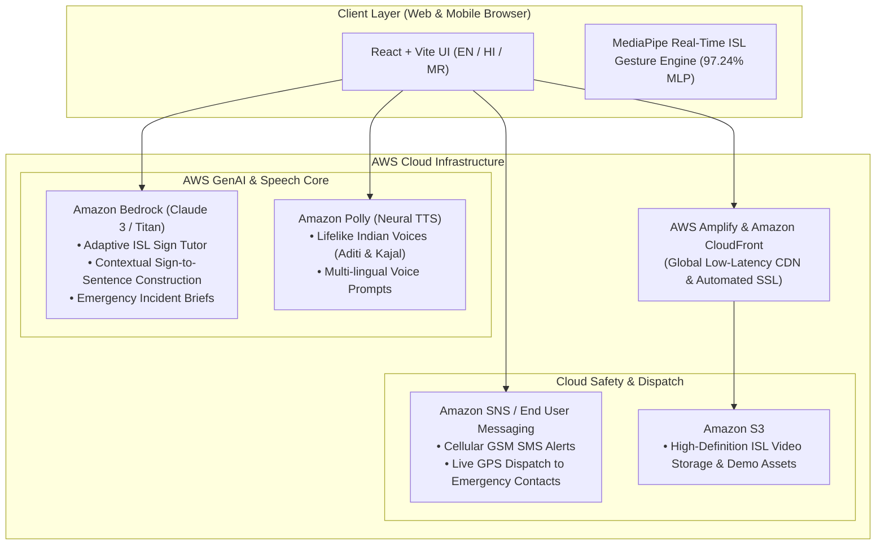
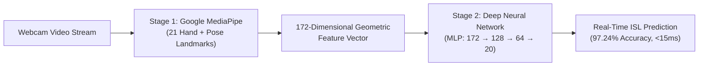

# SignSafe AI: Indian Sign Language Learning & Emergency Safety Platform 🤟🚨

[](https://main.d3aunvxyxb078t.amplifyapp.com/)
[](https://main.d3aunvxyxb078t.amplifyapp.com/)
[](https://main.d3aunvxyxb078t.amplifyapp.com/)

An AI-powered, cloud-native **Indian Sign Language (ISL)** learning platform and real-time emergency safety tool designed for deaf children, students, teachers, and schools.

🌐 **Live Application on AWS:** [https://main.d3aunvxyxb078t.amplifyapp.com](https://main.d3aunvxyxb078t.amplifyapp.com/)

---

## 🌟 Key Features

### 👧 1. Child Learner Panel (SignSync)
* **Complete 4-Level ISL Curriculum (48 Signs)**:
  * **🌱 Level 1 (Greetings — 10 Signs):** Hello, Namaste, Good Morning, Good Afternoon, Good Evening, Good Night, Good Day, How Are You, Happy Birthday, Happy Anniversary.
  * **🎨 Level 2 (Colours — 10 Signs):** Black, Brown, Green, Grey, Orange, Pink, Red, Violet, White, Yellow.
  * **🔤 Level 3 (Alphabets — Complete A–Z Fingerspelling):** 26 full ISL alphabet mudras with visual guidance charts.
  * **🚨 Level 4 (Emergency & Safety):** Help, Safe.
* **Official ISLRTC Reference Media:** High-definition video demonstrations from the official Indian Sign Language Research and Training Centre (ISLRTC) for every single sign.
* **Real-Time AI Vision Evaluation (Webcam):**
  * Tracks **21 skeletal hand landmarks** and **upper-body pose keypoints** in real time using Google MediaPipe.
  * Evaluated against an embedded **97.24% accuracy Deep Neural Network (MLP)**.
  * Gamified instant feedback: percentage accuracy score, celebration stars, and unlocked badges.

---

### 🇮🇳 2. Trilingual Multi-Language Support
* **English 🇬🇧, हिन्दी 🇮🇳, and मराठी 🚩**:
  * Sign names, step-by-step performance descriptions, and visual hints dynamically translated.
  * Spoken audio guidance synthesized in native languages.
  * Localized achievements, badges, and teacher reports.

---

### 🚨 3. SafeSOS Universal Emergency System & Cellular SMS Fallback
* **Visual Strobe Notification:** High-contrast flashing strobe alert designed specifically for deaf individuals who cannot hear standard audible alarms.
* **1-Tap Direct Cellular GSM SMS (`sms:+91...`):** Operates without active internet or mobile data during natural disasters or power cuts.
* **Live GPS Geo-Dispatcher:** Automatic coordinates tracking with one-tap Google Maps integration.
* **Dynamic Safety Status:** "I AM SAFE NOW", "I NEED ASSISTANCE", "I AM IN DANGER".

---

## ☁️ AWS Cloud Architecture

SignSafe AI is deployed and powered by a cloud-native AWS serverless infrastructure:



| AWS Service | Role in SignSafe AI |
| :--- | :--- |
| **AWS Amplify** | Automated CI/CD deployment, branch previews, and global hosting. |
| **Amazon CloudFront** | Ultra-low latency edge caching for video demonstration playback across India. |
| **Amazon Bedrock** | Generative AI tutor analyzing gesture accuracy and generating natural sign-to-speech sentences. |
| **Amazon Polly** | Neural text-to-speech with Indian accents (*Aditi* for Hindi/Marathi, *Kajal* for Indian English). |
| **Amazon SNS** | High-priority cellular GSM distress SMS and emergency guardian notifications. |
| **Amazon S3** | High-speed object storage for ISL training assets, alphabet charts, and demonstration videos. |

---

## 🧠 AI & Machine Learning Architecture

Our system utilizes a **2-stage, privacy-first computer vision pipeline**:



1. **Stage 1 — Landmark Extraction:**
   * Tracks 21 $(x, y, z)$ coordinates per hand + upper-body keypoints.
   * Computes **172 geometric features**: normalized hand shapes, finger extension states, and spatial distances.
2. **Stage 2 — Deep Neural Network (MLP Classifier):**
   * **Architecture:** $172 \text{ inputs} \rightarrow 128 \text{ neurons (ReLU)} \rightarrow 64 \text{ neurons (ReLU)} \rightarrow 20 \text{ output classes (Softmax)}$.
   * **Accuracy:** **97.24%** test accuracy across official ISLRTC benchmark datasets.
   * **Privacy First:** 100% in-browser zero-latency forward pass; no private camera feeds leave the student's device.

---

## 🚀 Getting Started Locally

```bash
# 1. Clone the repository
git clone https://github.com/prajaktaukirde/sign-safe.git
cd sign-safe

# 2. Install dependencies
npm install

# 3. Start local development server
npm run dev
```

Visit `http://localhost:8080/` to test locally.

---

## 👥 Authors & Acknowledgments

* **Prajakta Ukirde** — Lead Developer & ML Engineer
* Built for **First Commit (AWS Hackathon)**.
