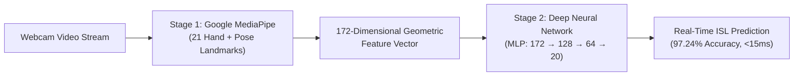

# SignSafe AI: Indian Sign Language Learning & Emergency Safety Platform 🤟🚨

An AI-powered, interactive **Indian Sign Language (ISL)** educational platform and real-time emergency safety tool designed for deaf children, students, teachers, and schools.

---

## 🌟 Key Features

### 👧 1. Child Learner Panel (SignSync)
* **Step-by-Step ISL Curriculum**:
  * **🌱 Level 1 (Greetings — 10 Signs):** Hello, Namaste, Good Morning, Good Afternoon, Good Evening, Good Night, Good Day, How Are You, Happy Birthday, Happy Anniversary.
  * **🎨 Level 2 (Colours — 10 Signs):** Black, Brown, Green, Grey, Orange, Pink, Red, Violet, White, Yellow.
  * **🏫 Level 3 (School & Learning):** Teacher, Book, Question.
  * **🚨 Level 4 (Emergency & Safety):** Help, Safe.
* **Official ISLRTC Demonstration Videos:**
  * High-definition reference video demonstrations from the official Indian Sign Language Research and Training Centre (ISLRTC) for every single sign.
  * Loop playback, full controls, and adjustable playback speeds ($0.75\times$ to $1.5\times$).
* **Real-Time AI Vision Evaluation (Webcam):**
  * Tracks **21 skeletal hand landmarks** and **body pose keypoints** in real time using Google MediaPipe.
  * Evaluated against an embedded **97.24% accuracy Deep Neural Network (MLP)** trained on official ISLRTC sign videos.
  * Gamified instant feedback: celebration confetti, percentage accuracy score, and achievement badges!

---

### 👩‍🏫 2. Parent & Teacher Panel
* **Live Classroom Voice Transcription:**
  * Teachers speak into the microphone or type lecture notes.
  * Speech is converted to text and mirrored on the student's screen in real time.
* **Real-Time Student Question Inbox:**
  * Deaf students can submit sign-translated questions directly to the teacher's dashboard via WebSocket.
* **Emergency Dispatch Controls:**
  * Instant one-click broadcast trigger for school-wide visual strobe and acoustic alerts.

---

### 🚨 3. SafeSOS Universal Emergency System
* **Visual Strobe Notification:** High-contrast flashing strobe alert designed specifically for deaf individuals who cannot hear standard audible alarms.
* **Interactive Evacuation Floorplan:** Dynamic building map highlighting safe exit paths and emergency exits with pulsing indicators.
* **One-Click Distress Beacon:** Quick-action status buttons (**"I AM OK"** / **"I NEED HELP"**) broadcasting student safety status and room location to responders.

---

## 🧠 AI & Machine Learning Architecture

Our system utilizes a **2-stage, privacy-first computer vision pipeline**:



1. **Stage 1 — Landmark Extraction:**
   * **`hand_landmarker.task`** tracks 21 $(x, y, z)$ coordinates per hand.
   * **`pose_landmarker.task`** tracks upper-body keypoints (shoulders, elbows, nose).
   * Computes **172 geometric features**: normalized hand shapes, finger extension states (open hand, fist, pointing, thumbs-up), and spatial distance from face/body.
   * Dataset: **2,411 landmark samples** extracted from ISLRTC videos.

2. **Stage 2 — Deep Neural Network (MLP Classifier):**
   * **Architecture:** $172 \text{ inputs} \rightarrow 128 \text{ neurons (ReLU)} \rightarrow 64 \text{ neurons (ReLU)} \rightarrow 20 \text{ output classes (Softmax)}$.
   * **Accuracy:** **97.24%** test accuracy across all 20 classes.
   * **Embedded Weights:** Exported directly to [`src/lib/isl-model-data.ts`](src/lib/isl-model-data.ts) for pure in-browser matrix multiplication via [`src/lib/isl-nn.ts`](src/lib/isl-nn.ts).

3. **100% Client-Side Privacy:**
   * Video frames are processed entirely inside the browser's memory and **never transmitted to any external server**.

---

## 📁 Repository Structure

```text
sign-safe/
├── ml_models/                   # AI training pipeline and pre-trained models
│   ├── extract_and_train_all.py # Extracts 172D landmarks and trains 20-class MLP
│   ├── train_model.py           # Neural network training script
│   ├── extract_dataset.py       # Landmark extractor utility
│   ├── hand_landmarker.task     # Google MediaPipe hand landmark model
│   └── pose_landmarker.task     # Google MediaPipe pose landmark model
├── public/
│   ├── level1-greeting/         # 10 official ISL greeting demonstration videos
│   ├── level2-colour/           # 10 official ISL colour demonstration videos
│   └── model/                   # Model metadata
├── server/                      # Node.js + Express + Socket.IO backend
├── src/
│   ├── components/app/
│   │   ├── StudentView.tsx      # Child learning interface with video players & webcam
│   │   ├── TeacherView.tsx      # Teacher transcription and classroom dashboard
│   │   ├── WebcamMock.tsx       # Live MediaPipe webcam gesture recognition component
│   │   ├── SosOverlay.tsx       # Universal visual strobe and evacuation floorplan
│   │   └── HeroLanding.tsx      # Landing page and lesson navigation
│   ├── lib/
│   │   ├── isl-model-data.ts    # Embedded 20-class trained neural network weights
│   │   ├── isl-nn.ts            # Pure TypeScript zero-latency forward pass engine
│   │   └── demo-store.tsx       # Global application state store
│   └── routes/                  # TanStack Start application routes
├── package.json
└── vite.config.ts
```

---

## 🛠️ Technology Stack

* **Frontend:** React 19, TypeScript, TanStack Start, Vite
* **Styling:** Tailwind CSS, Lucide Icons
* **Machine Learning & Computer Vision:** Google MediaPipe Tasks, scikit-learn (MLPClassifier), NumPy, OpenCV
* **Real-Time Networking:** Socket.IO Client & Server
* **Backend:** Node.js, Express

---

## 🚀 Getting Started

### 1. Clone the Repository
```bash
git clone https://github.com/prajaktaukirde/sign-safe.git
cd sign-safe
```

### 2. Install Dependencies
```bash
npm install
```

### 3. Run the Development Server
```bash
npm run dev
```
Open your browser and navigate to `http://localhost:8080/` (or `http://localhost:8081/`).

### 4. Build for Production
```bash
npm run build
```

---

## 📄 License
This project is open source and available under the [MIT License](LICENSE).

