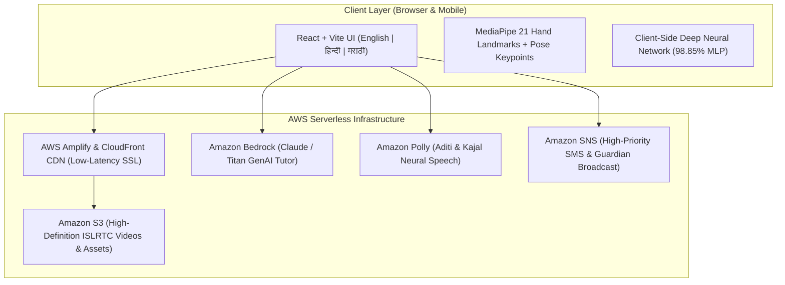

# SignSafe AI: Indian Sign Language Learning, Interactive Sentence Studio & Emergency Safety Platform 🤟🚨

[](https://main.d3aunvxyxb078t.amplifyapp.com/)
[](https://main.d3aunvxyxb078t.amplifyapp.com/)
[](https://main.d3aunvxyxb078t.amplifyapp.com/)
[](https://main.d3aunvxyxb078t.amplifyapp.com/)

An AI-powered, cloud-native **Indian Sign Language (ISL)** educational platform, interactive sentence practice studio, exam arena, and real-time emergency safety system designed for deaf children, students, teachers, and schools.

🌐 **Live Application on AWS:** [https://main.d3aunvxyxb078t.amplifyapp.com](https://main.d3aunvxyxb078t.amplifyapp.com/)

---

## 🌟 Comprehensive 11-Module Curriculum (122+ Signs)

SignSafe AI features a comprehensive pedagogical curriculum aligned with **ISLRTC (Indian Sign Language Research and Training Centre)** national standards:

| Level / Module | Topic Category | Signs Included | Learning & Evaluation Mode |
| :--- | :--- | :--- | :--- |
| **🌱 Level 1** | **Greetings & Courtesies** | 10 Signs (*Hello, Namaste, Good Morning, Good Afternoon, Good Evening, Good Night, Good Day, How Are You, Happy Birthday, Happy Anniversary*) | Live AI Computer Vision + Pose Estimation |
| **🎨 Level 2** | **Colours & Visual Adjectives** | 10 Signs (*Black, Brown, Green, Grey, Orange, Pink, Red, Violet, White, Yellow*) | Real-Time Landmark Matching |
| **🔤 Level 3** | **Fingerspelling Alphabets (A–Z)** | 26 Mudras (*Full standard ISL A through Z alphabet gestures*) | 98.85% Trained MLP Neural Classifier |
| **🎉 Level 4** | **Cultural Festivals & Celebrations** | 12 Signs (*Diwali, Holi, Christmas, Eid, Ganesh Chaturthi, Navratri, Durga Puja, Dussehra, Raksha Bandhan, Janmashtami, Independence Day, Republic Day*) | AI Computer Vision + Gesture Guidance |
| **🔢 Level 5** | **Numbers & Counting** | 23 Signs (*1 to 15, 25, 50, 100, 1000, 10000, 100000, 1000000, 10cr*) | Real-Time Finger Geometry & Counting |
| **💼 Level 6** | **Jobs & Professions** | 9 Signs (*Teacher, Doctor, Driver, Farmer, Lawyer, Barber, Postman, Sweeper, Writer*) | Landmark Classifier Model |
| **👨‍👩‍👧‍👦 Level 7** | **Family & Relationships** | 12 Signs (*Father, Mother, Brother, Daughter, Husband, Wife, Married, Grandfather, Grandmother, Family, Man, Woman*) | Kinship Pose Verification |
| **❓ Level 8** | **Question Words & Concepts** | 12 Signs (*What, Where, When, Which, Who, How, Question, Answer, Time, Place, Face, This*) | Wh-Inquiry Spatial Alignment |
| **💬 Level 9** | **Daily Conversation & Sentences** | 15 Full Sentences (*Organized into 5 Sub-Topics*) | **Interactive Practice Studio** + Video Speed + ISL Sign Gloss |
| **🚨 Level 10** | **Emergency & Life Safety** | 3 Signs (*Safe, Help, Emergency Distress*) | Instant Status Dispatcher (`OK` / `HELP` / `TRAPPED`) |
| **🚨 Module 11** | **Smart SOS Emergency Hub** | Full Safety Dispatch Suite | Visual Strobe Alarm, Live GPS, WhatsApp & Cellular SMS Dispatch |

---

## 🎥 Level 9 Conversational Sentences Practice Studio

For complex sentence sequences, SignSafe features a dedicated **Webcam Practice Studio** with word-by-word syntax analysis:

### 5 Structured Sentence Categories:
1. **Introductions & Identity (4 phrases):**
   * *Hello, Nice to Meet You* — `[HELLO 👋] + [MEET 🤝] + [HAPPY 😊]`
   * *My Name Is Priya* — `[MY / ME 🙋] + [NAME 📛] + [PRIYA 👧]`
   * *I Am Deaf* — `[ME 🙋] + [DEAF 🧏]`
   * *I Know Sign Language* — `[ME 🙋] + [KNOW 💡] + [SIGN LANGUAGE 🤟]`
2. **Daily Questions & Inquiries (4 phrases):**
   * *What Is Your Name?* — `[YOUR 👉] + [NAME 📛] + [WHAT ❓]`
   * *Where Are You From?* — `[YOU 👉] + [LOCATION 🏡] + [WHERE 📍]`
   * *What Do You Do? (Work)* — `[YOU 👉] + [WORK 💼] + [WHAT ❓]`
   * *What Is Your Father's Name?* — `[YOUR 👉] + [FATHER 👨] + [NAME 📛] + [WHAT ❓]`
3. **Roles & Warm Wishes (2 phrases):**
   * *My Profession (Student / Doctor)* — `[MY 🙋] + [ROLE 🎓]`
   * *Hope You Are Healthy & Happy* — `[FRIENDS 👥] + [HEALTHY 💪] + [HAPPY 😊]`
4. **Signing Speed & Assistance (3 phrases):**
   * *Please Sign Slowly* — `[PLEASE 🙏] + [SIGN 🤟] + [SLOW 🐢]`
   * *Could You Please Sign Again?* — `[PLEASE 🙏] + [SIGN 🤟] + [REPEAT 🔁]`
   * *You Are Signing Very Fast* — `[YOU 👉] + [SIGNING 🤟] + [VERY FAST ⚡]`
5. **Comprehension & Understanding (2 phrases):**
   * *Yes, I Understand* — `[YES 👍] + [I 🙋] + [UNDERSTAND 💡]`
   * *I Don't Understand* — `[NO 👎] + [I 🙋] + [DONT UNDERSTAND 🤷]`

### Studio Capabilities:
* **Video Playback Speed Controller:** Toggle between `0.5x (Slow Motion)`, `0.75x (Rehearsal)`, and `1.0x (Standard Speed)` to study complex transitions.
* **ISL Sign Structure Gloss Badges:** Visual word-by-word sequential chips illustrating grammatical structure.
* **Self-Rehearsal Camera Mirror:** Real-time webcam reflection alongside the instructor video.
* **Progress Verification:** "Mark as Practiced ✓" button logs completions with celebratory audio feedback.

---

## 🏆 Assessment Test Arena & Printable Certificates

* **Dual Examination Formats:**
  1. **AI Camera Practical Exam:** Real-time computer vision verification of student sign accuracy.
  2. **Visual Theory MCQ Exam:** 4-option visual multiple-choice quiz with embedded video prompts.
* **Customizable Timers:** 15s, 20s, 30s per question or untimed mode.
* **Accredited Printable Certificate:** Automated calculation of Distinction / First Class grades (`A+`, `A`, `B`) and one-click printable official ISL Certificate.

---

## 🚨 SafeSOS Universal Emergency Suite

* **Visual Strobe Notification:** High-contrast flashing strobe alert designed specifically for deaf individuals who cannot hear standard sirens.
* **1-Tap WhatsApp & Cellular GSM SMS (`sms:+91...`):** Dispatches distress alerts even without mobile data during power cuts or disasters.
* **Live GPS Geo-Tracking:** Instant latitude/longitude dispatch to registered guardians with Google Maps coordinates.
* **Dynamic Safety Status Dispatch:** One-tap confirmation: "I AM SAFE NOW", "I NEED ASSISTANCE", "I AM IN DANGER".

---

## ☁️ Cloud Architecture & AI Pipeline


```mermaid
flowchart TD
    subgraph Client ["Client Layer (Browser & Mobile)"]
        UI["React + Vite UI (English | हिन्दी | मराठी)"]
        CV["MediaPipe 21 Hand Landmarks + Pose Keypoints"]
        MLP["Client-Side Deep Neural Network (98.85% MLP)"]
    end

    subgraph Cloud ["AWS Serverless Infrastructure"]
        Amplify["AWS Amplify & CloudFront CDN (Low-Latency SSL)"]
        Bedrock["Amazon Bedrock (Claude / Titan GenAI Tutor)"]
        Polly["Amazon Polly (Aditi & Kajal Neural Speech)"]
        SNS["Amazon SNS (High-Priority SMS & Guardian Broadcast)"]
        S3["Amazon S3 (High-Definition ISLRTC Videos & Assets)"]
    end

    UI --> Amplify
    UI --> Bedrock
    UI --> Polly
    UI --> SNS
    Amplify --> S3
```

---

## 🚀 Getting Started Locally

```bash
# 1. Clone the repository
git clone https://github.com/prajaktaukirde/sign-safe.git
cd sign-safe

# 2. Install dependencies
npm install

# 3. Start local development server
npm run dev
```

Visit `http://localhost:8080/` in your browser.

---

## 👥 Authors & Acknowledgments

* **Prajakta Ukirde** — Lead Developer & ML Engineer
* Built for **First Commit (AWS Hackathon)** and B-Tech Computer Science Engineering Capstone.
